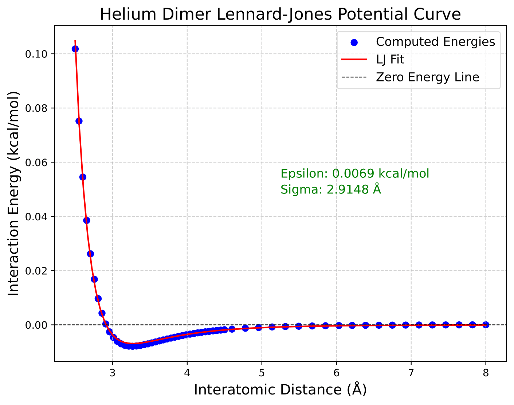

# Helium Dimer Lennard-Jones Potential Curve

This repository contains a Python script to compute the interaction energy of a helium dimer using Gaussian MP2 calculations and to fit the results to a Lennard-Jones potential curve. The script also generates plots of the computed energies and the fitted potential curve.

## Features
- Generates Gaussian input files for a range of interatomic distances.
- Extracts interaction energies from Gaussian log files.
- Converts energies to kcal/mol and subtracts reference energy for proper fitting.
- Fits the interaction energies to the Lennard-Jones potential function.
- Produces a publication-ready plot of the potential curve.

## Prerequisites
Ensure the following dependencies are installed:
- Python 3.7+
- Gaussian software (`g16`) installed and accessible in the system's path.
- Python libraries:
  - `numpy`
  - `matplotlib`
  - `scipy`

You can install the required Python packages using:
```bash
pip install numpy matplotlib scipy
```

## Usage
1. Clone this repository:
   ```bash
   git clone https://github.com/yourusername/helium-dimer-lj.git
   cd helium-dimer-lj
   ```

2. Run the script:
   ```bash
   python S0.py
   ```

3. View the generated Lennard-Jones potential plot (`he_dimer_lj_plot.pdf`).

### Adding Images to README
To include images in your README, follow these steps:
1. Save your plot image in the repository folder (e.g., `images/he_dimer_lj_plot.png`).
2. Add the image to the README using Markdown syntax:
   ```markdown
   
   ```
   Replace `images/he_dimer_lj_plot.png` with the relative path to your image.

## File Structure
- `S0.py`: Main Python script for generating input files, running calculations, extracting results, and plotting.
- `inputs/`: Directory for Gaussian input files (created automatically).
- `outputs/`: Directory for Gaussian log files (created automatically).
- `he_dimer_lj_plot.pdf`: Output plot showing the Lennard-Jones potential curve.

## Example Plot


## Contributing
Contributions are welcome! Feel free to open issues or submit pull requests.

## License
This project is licensed under the MIT License. See the `LICENSE` file for details.

